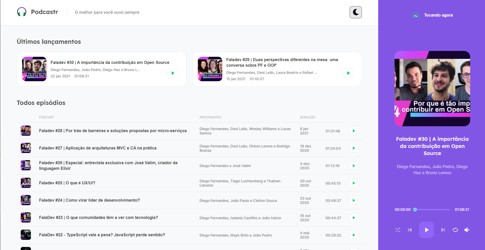
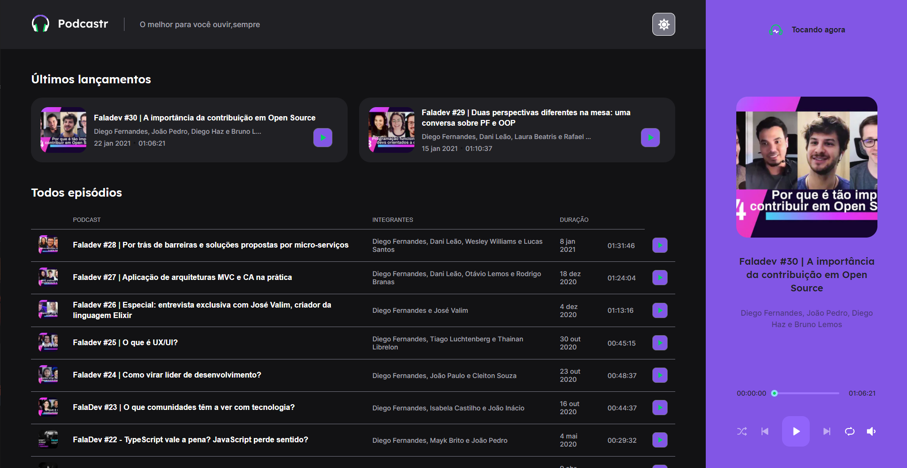

<p align="center">
   
</p>

# About

Essa Aplicação tem o proposito de servir como App/site de uma produtora de Podcasts, onde eles ficarão disponíveis para serem escutados e também será possivel acessar as notas dos episodios.

Esta projeto foi desenvolvido durante o evento NLW#05 - Trilha de React da <a href="https://rocketseat.com.br"> Rocketseat </a>.

# Layout

<p align="center">
    <a title="Open with figma" href="https://www.figma.com/file/gyvOlWGBJQNdIjg69PxSZC/Podcastr?node-id=160%3A2761">
        
    </a>
</p>




# Tecnologias

Este projeto foi desenvolvido utilizando as seguintes tecnologias:

- [Next.js](https://nextjs.org/)
- [Sass](https://sass-lang.com/)
- [React](https://reactjs.org/)
- [TypeScript](https://www.typescriptlang.org/)

- [JSON Server](https://github.com/typicode/json-server)

# Preview

<a title="Deployed with Vercel" href="https://#-rawallon.vercel.app/">

</a>

# How to run

Clone the project and access the folder

```bash
# Clone repo
$ git clone https://github.com/Rawallon/podcastr.git && cd podcastr

# Install the dependencies
$ npm install

# Run in development mode
$ npm dev

# Note: Its possible to build it on your local machine
# and then use output of it in a low cost (or even free) host
$ npm build

```
